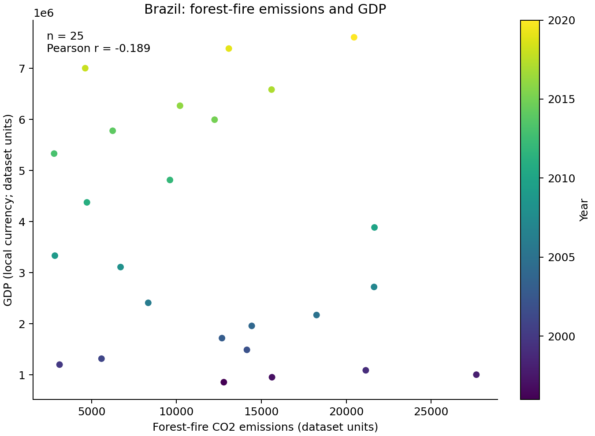
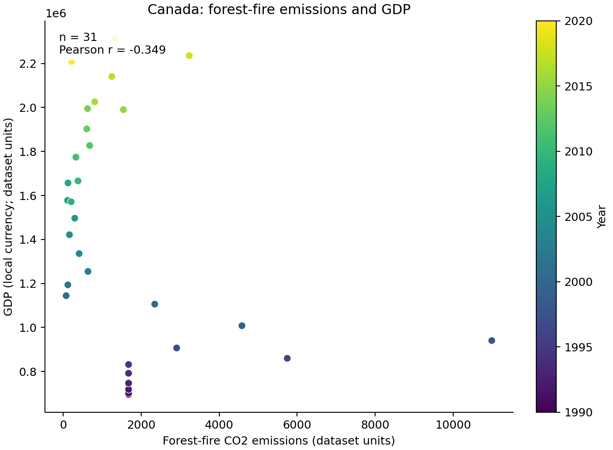
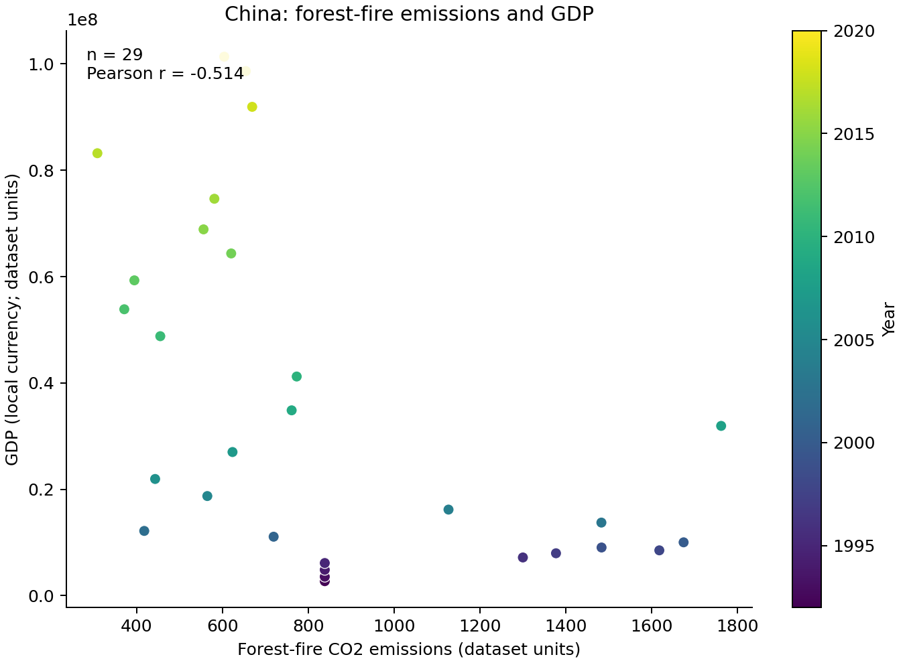
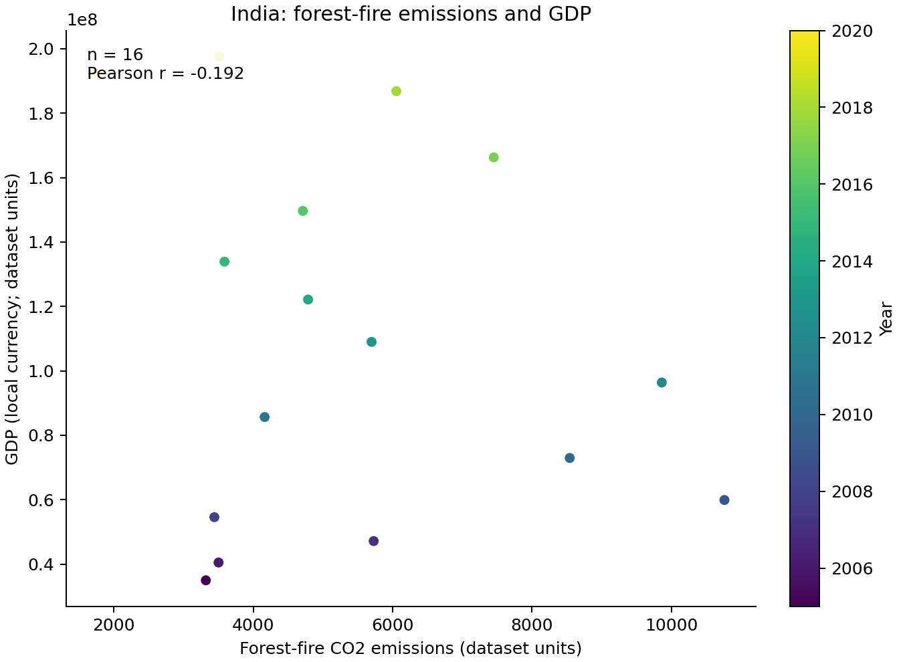

# Forest-Fire Emissions and GDP

## Introduction

This analysis examines the country-level association between forest-fire CO2 emissions and GDP. Each point represents one year with both values available. Countries are plotted separately because GDP is reported in local currency and its numeric scale is not comparable across countries.

## Results

All four countries show a negative Pearson correlation in the paired annual observations, but its strength varies. These are descriptive, contemporaneous associations, not evidence that GDP changes cause forest-fire emissions to change; trends over time and other factors may influence both.

### Brazil

Brazil has 25 paired observations from 1996 through 2020 and a weak negative association (`r = -0.189`).



### Canada

Canada has 31 paired observations from 1990 through 2020 and a modest negative association (`r = -0.349`).



### China

China has 29 paired observations from 1992 through 2020 and the strongest negative association among these countries (`r = -0.514`).



### India

India has 16 paired observations from 2005 through 2020 and a weak negative association (`r = -0.192`).



## Methods

The script reads the downloaded CSV files, selects the forest-fire emissions series and GDP row for each country, joins values by year, and omits years with missing values. It creates one scatterplot per country; points are colored by year, and each chart reports the paired-observation count and Pearson correlation. Correlations are calculated within each country's series and are not pooled. The GDP and emissions axes retain their dataset units.

Run these commands from the repository root to download the data, install the plotting dependency, and create the plots:

```sh
mkdir -p data
curl -L --fail "https://docs.google.com/uc?export=download&id=1AsXP_OGs1O_TDeXiZjk3fYV1SrG4vwXF" -o data/Agrofood_co2_emission.csv
curl -L --fail "https://docs.google.com/uc?export=download&id=19YEPysdnK7VCXuAe9Og9pwYkNT5CbQzr" -o data/IMF_GDP.csv
python3 -m pip install -r requirements.txt
python3 src/scatter.py --countries Brazil Canada China India
```

The command writes `plots/brazil.png`, `plots/canada.png`, `plots/china.png`, and `plots/india.png`. Pass `--countries` with other exact country names to analyze a different set.
